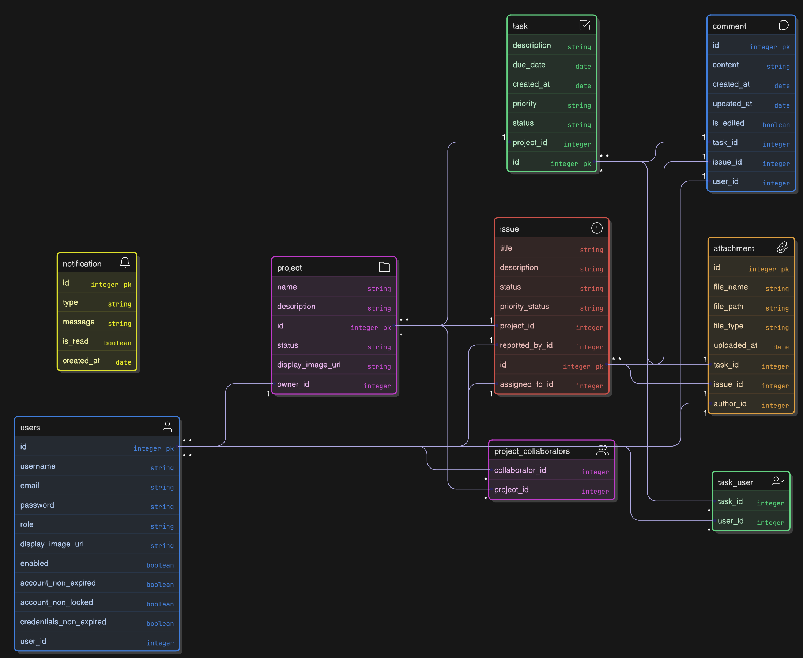

# Project Management System - Spring Boot & PostgreSQL

## 📌 Overview
This is a **Project Management System** built using **Spring Boot** and **PostgreSQL**. The application allows users to **create projects, assign tasks, track progress, manage issues, and collaborate** with team members. It also includes features like **JWT-based authentication, real-time notifications, email alerts (AWS SES), and file storage (AWS S3).**

## 🚀 Features
- **User Authentication & Authorization** (JWT, Role-Based Access Control)
- **Project Management** (Create, Update, Delete projects)
- **Task Management** (Kanban-style tasks, assignments, due dates, statuses)
- **Issue Tracking** (Bug reports, prioritization, and resolution tracking)
- **Notifications** (Real-time WebSockets & Email alerts via AWS SES)
- **File Storage** (AWS S3 integration for document uploads)
- **Database Management** (PostgreSQL with JPA & Hibernate)
- **Caching** (Redis for performance optimization)
- **Security** (Spring Security, HTTPS, CSRF protection)
- **Deployment** (Dockerized, AWS ECS, RDS, Load Balancer, VPC)

## 📊 Database Schema



## 🏗️ Project Structure
```
pfk-project-management/
│── src/main/java/com/pfk/projectmanagement/
│   ├── audit/              # Configuration for Audit Aware
│   ├── config/             # Configuration files (Security, CORS, DB, etc.)
│   ├── controller/         # REST API controllers
│   ├── dto/                # Data Transfer Objects (DTOs)
│   ├── entity/             # JPA Entities (Database Models)
│   ├── repository/         # Repository Interfaces (Spring Data JPA)
│   ├── service/            # Business logic (Service Layer)
│   ├── util/               # Utility classes (mappers, constants, helpers)
│   ├── exception/          # Global exception handling (`@ControllerAdvice`)
│── src/main/resources/
│── application.yml         # Configuration file
│── Dockerfile              # Docker setup
│── README.md               # Project documentation
```

## 🛠️ Tech Stack
- **Backend**: Spring Boot, Spring Security, JWT
- **Database**: PostgreSQL, Hibernate (JPA)
- **Caching**: Redis
- **Messaging**: WebSockets
- **Storage**: AWS S3
- **Email**: AWS SES
- **Deployment**: Docker, AWS ECS, RDS, Load Balancer

## 🔧 Installation & Setup
### Prerequisites
- Java 23+
- PostgreSQL
- Redis (for caching)
- Docker (if running inside a container)

### Step 1: Clone Repository
```bash
git clone https://github.com/your-repo/pfk-project-management.git
cd pfk-project-management
```

### Step 2: Configure Database
Update `application.yml` with your **PostgreSQL credentials**:
```yaml
spring:
  datasource:
    url: jdbc:postgresql://localhost:5432/project_management
    username: your_username
    password: your_password
```

### Step 3: Build & Run
```bash
mvn clean install
mvn spring-boot:run
```

### Step 4: API Endpoints
### Projects
- `POST /api/v1/projects` - Create a new project
- `GET /api/v1/projects` - Get all projects
- `GET /api/v1/projects/{projectId}` - Get project details by ID
- `PUT /api/v1/projects/{projectId}` - Update project details
- `DELETE /api/v1/projects/{projectId}` - Delete a project
- `PATCH /api/v1/projects/{projectId}/collaborators/{userId}` - Add a collaborator to project
- `DELETE /api/v1/projects/{projectId}/collaborators/{userId}` - Remove a collaborator from project

### Tasks
- `POST /api/v1/tasks` - Create a new task
- `GET /api/v1/tasks` - Get all tasks
- `GET /api/v1/tasks/{taskId}` - Get task details by ID
- `PUT /api/v1/tasks/{taskId}` - Update task details
- `DELETE /api/v1/tasks/{taskId}` - Delete a task
- `PATCH /api/v1/tasks/{taskId}/users/{userId}` - Assign user to task
- `DELETE /api/v1/tasks/{taskId}/users/{userId}` - Remove user from task

### Issues
- `POST /api/v1/issues` - Create a new issue
- `GET /api/v1/issues` - Get all issues
- `GET /api/v1/issues/{issueId}` - Get issue details by ID
- `PUT /api/v1/issues/{issueId}` - Update issue details
- `DELETE /api/v1/issues/{issueId}` - Delete an issue

### Attachments
- `POST /api/v1/attachments/task/{taskId}` - Upload attachment for a task
- `POST /api/v1/attachments/issue/{issueId}` - Upload attachment for an issue
- `DELETE /api/v1/attachments/{attachmentId}` - Delete an attachment

### Notifications
  - `GET /api/notifications` - Fetch user notifications
  
## 🚀 Deployment
### **Docker Setup**
Build and run the application using Docker:
```bash
docker build -t pfk-project-management .
docker run -p 8080:8080 pfk-project-management
```

### **AWS Deployment**
1. Deploy **PostgreSQL on AWS RDS**
2. Use **AWS S3** for file storage
3. Set up **AWS ECS** for containerized deployment
4. Configure **AWS SES** for email notifications
5. Use **Application Load Balancer & Auto Scaling**

## ✅ Security Best Practices
- **JWT-based Authentication**
- **Role-based Authorization (RBAC)**
- **Data Encryption & HTTPS Enforcement**
- **API Rate Limiting & CSRF Protection**

## 📜 License
This project is licensed under the MIT License.

## 👨‍💻 Contributors
- **Nuh Ali** - Developer

## 📧 Contact
For support or inquiries, email: **noah@pfkdigital.co.uk**

